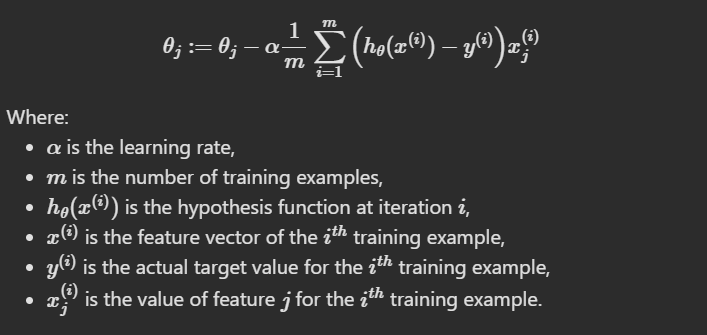

# Linear Regression Using Gradient Descent
Linear regression can also be performed using a technique called gradient descent, where the coefficients (or weights) of the model are iteratively adjusted to minimize a cost function (usually mean squared error). This method is particularly useful when the number of features is too large for analytical solutions like the normal equation or when the feature matrix is not invertible. The gradient descent algorithm updates the weights by moving in the direction of the negative gradient of the cost function with respect to the weights. The updates occur iteratively until the algorithm converges to a minimum of the cost function. The update rule for each weight is given by:

**Things to note**: The choice of learning rate and the number of iterations are crucial for the convergence and performance of gradient descent. Too small a learning rate may lead to slow convergence, while too large a learning rate may cause overshooting and divergence.

# Practical Implementation
Implementing gradient descent involves initializing the weights, computing the gradient of the cost function, and iteratively updating the weights according to the update rule.