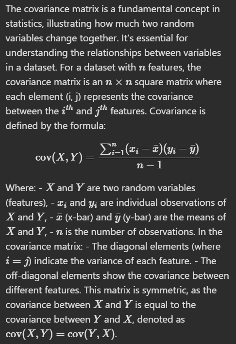

# Calculate Covariance Matrix (medium)

Write a Python function that calculates the covariance matrix from a list of vectors. Assume that the input list represents a dataset where each vector is a feature, and vectors are of equal length.

# Learn

